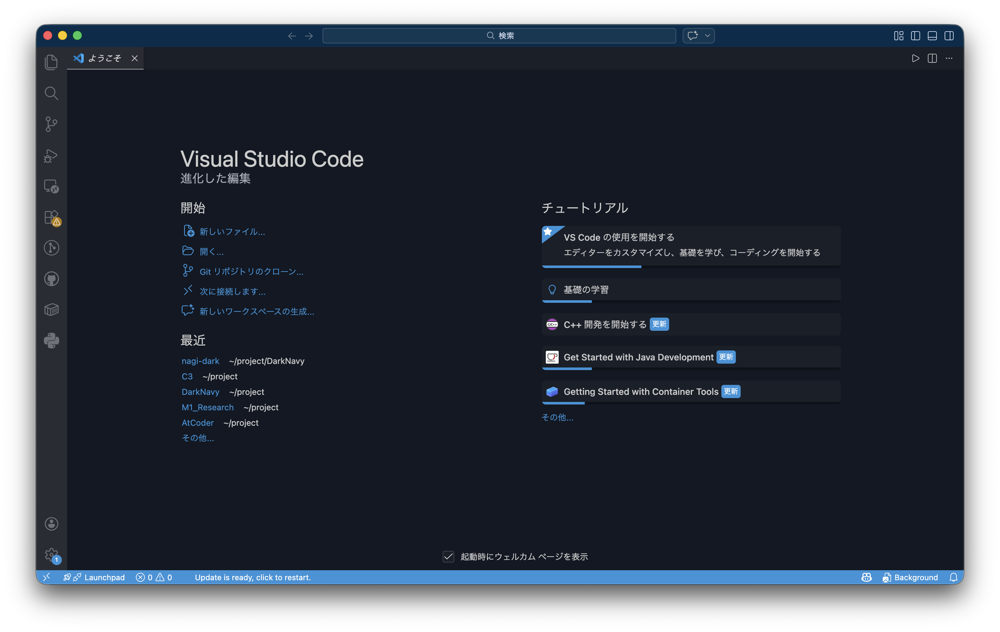
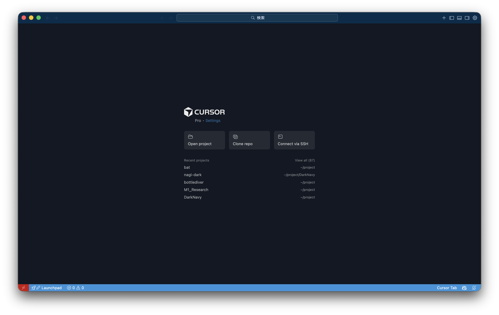
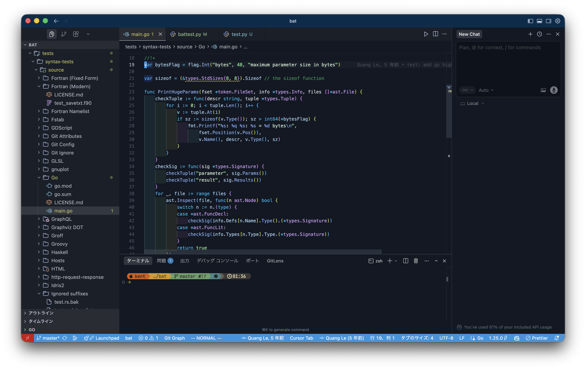
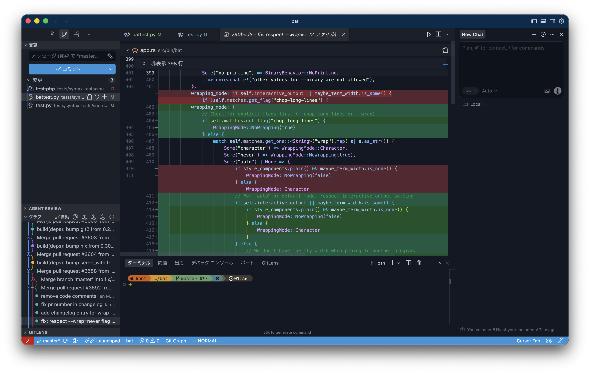

# Nagi Dark

## Overview

Nagi Dark is a dark theme for Visual Studio Code, named after the Japanese word 「凪」(nagi), meaning “calm” or “lull”.  
If you like it, please give [my repository](https://github.com/kent0011/nagi-dark) a star ⭐️

## Credits

This theme is built upon and inspired by the following amazing open-source themes:

- [One Dark Pro](https://github.com/Binaryify/OneDark-Pro) by Binaryify
- [Winter is Coming](https://github.com/johnpapa/vscode-winteriscoming) by John Papa

## Screenshots

Here are some screenshots of the theme in action:
<table>
  <tr>
    <td></td>
    <td></td>
  </tr>
  <tr>
    <td></td>
    <td></td>
  </tr>
</table>

---

## 概要

VS Code用のダークテーマ 『凪 Dark』
気に入っていただけたら[GitHub](https://github.com/kent0011/nagi-dark)にスターをお願いします！

## クレジット

このテーマは以下のオープンソーステーマに基づいて構築されています:

- [One Dark Pro](https://github.com/Binaryify/OneDark-Pro) by Binaryify
- [Winter is Coming](https://github.com/johnpapa/vscode-winteriscoming) by John Papa

